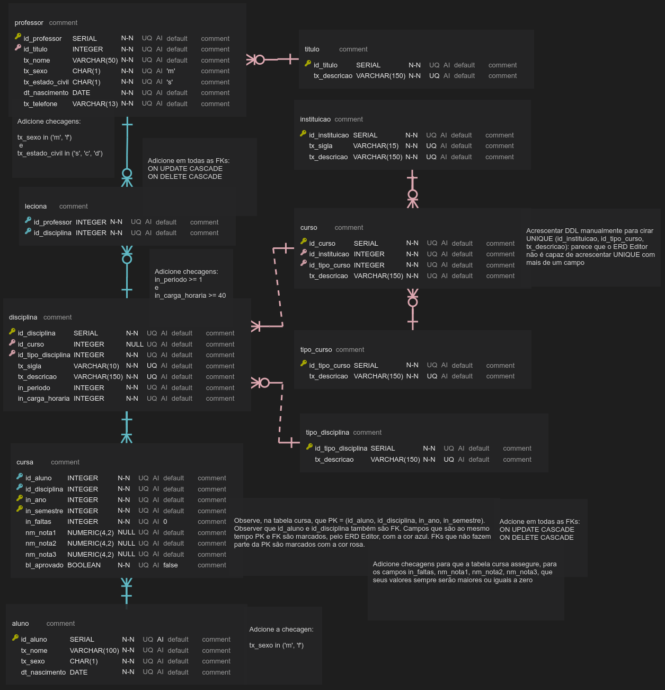
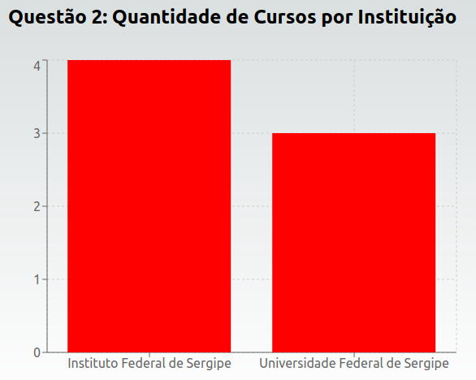
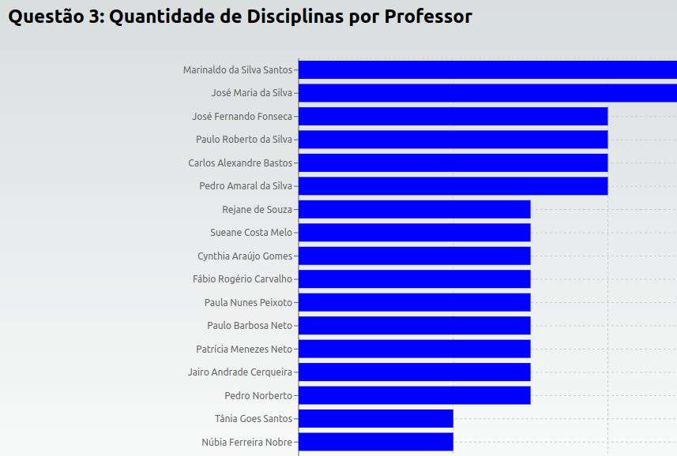
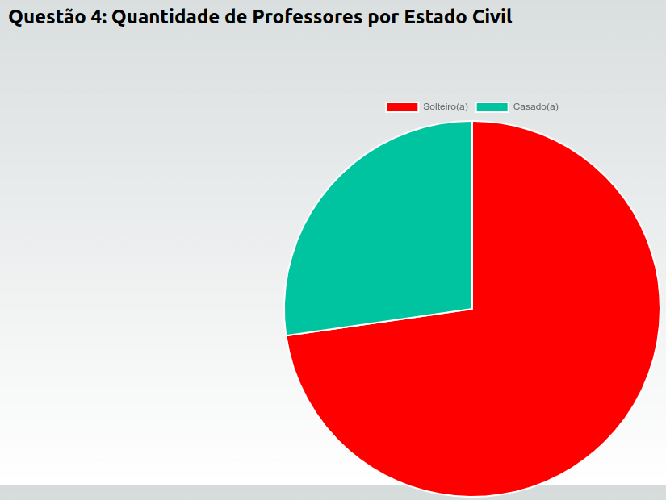
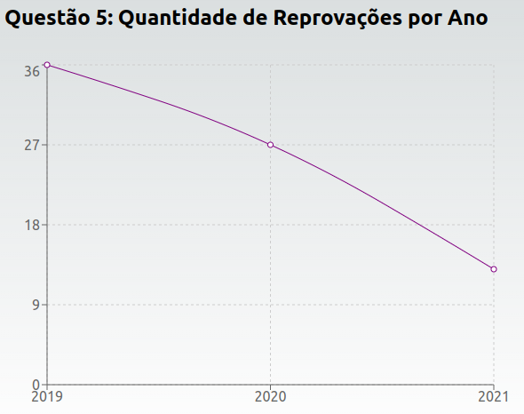

# Exercício: Construção de API REST e Visualização de Dados com Gráficos

## Objetivo

Neste exercício, você irá construir uma API REST baseada em um Diagrama Entidade-Relacionamento (DER) fornecido. A API REST que você desenvolverá deverá disponibilizar todos os endpoints necessários para resolver as questões de visualização de dados nas etapas seguintes. Em seguida, você utilizará os dados fornecidos pela API para criar gráficos que respondam a perguntas específicas.

## Questão 1: Construção da API REST

Utilize o DER abaixo para construir uma API REST completa. A API deve ser capaz de realizar operações de CRUD (Create, Read, Update, Delete) para todas as entidades representadas no DER. Além disso, a API deve incluir endpoints específicos que permitam calcular e retornar dados agregados, que serão utilizados nas próximas questões.

### Requisitos da API REST:
- **Tecnologia**: A API deve ser construída utilizando Node.js com Express, e utilizar PostgreSQL como banco de dados.
- **Estrutura**: A API deve incluir endpoints para cada entidade do DER, com operações de CRUD.
- **Endpoints Agregados**: Adicione endpoints que retornem dados agregados necessários para a construção dos gráficos nas questões seguintes.

## Questão 2: Quantidade de Cursos por Instituição

Construa um gráfico de barras que mostre a quantidade de cursos catalogados por cada instituição. Utilize o endpoint da API que retorna a quantidade de cursos por instituição para popular o gráfico.

- **Tecnologia**: Utilize React com a biblioteca `Recharts` ou `Chart.js` para construir o gráfico.
- **Endpoint da API**: `/cursos_por_instituicao`

## Questão 3: Quantidade de Disciplinas por Professor

Construa um gráfico de barras horizontal que mostre a quantidade de disciplinas lecionadas por cada professor. Utilize o endpoint da API que retorna a quantidade de disciplinas por professor para popular o gráfico.

- **Tecnologia**: Utilize React com a biblioteca `Recharts` ou `Chart.js` para construir o gráfico.
- **Endpoint da API**: `/disciplinas_por_professor`

## Questão 4: Quantidade de Professores por Estado Civil

Construa um gráfico de pizza que mostre a distribuição dos professores por estado civil. Utilize o endpoint da API que retorna a quantidade de professores por estado civil para popular o gráfico.

- **Tecnologia**: Utilize React com a biblioteca `Recharts` ou `Chart.js` para construir o gráfico.
- **Endpoint da API**: `/professores_por_estado_civil`

## Questão 5: Quantidade de Reprovações por Ano

Construa um gráfico de linha que mostre a quantidade de reprovações ao longo dos anos. Utilize o endpoint da API que retorna a quantidade de reprovações por ano para popular o gráfico.

- **Tecnologia**: Utilize React com a biblioteca `Recharts` ou `Chart.js` para construir o gráfico.
- **Endpoint da API**: `/reprovacoes_por_ano`

